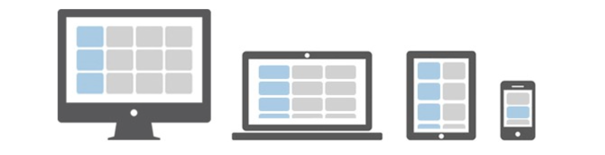

# Responsive Web Design (RWD)
RWD is the concept of developing a website in a way that allows the layout to automatically adjust according to the user’s screen resolution (called its viewport).

## Design for the Mobile Web
1. Build an entirely separate mobile .mobi site (x) Why not?
- Results in content synchronization issues
- Nobody is using .mobi TLDs

2. Host the mobile site within your current domain (a subdomain) (mobile.mycompany.com) (x) Why not?

- It requires redirect (takes time)
- It hinders search engines (by redirect)
- Requires duplication of content

3. Configure your current website for mobile display using
Responsive Web Design (RWD) techniques (✔️) 

RWD usability guidelines on mobile devices:
- **reduce amount of content**
- **change navigation**
## Media Queries
A media query consists of a media type (`screen`) and the actual query enclosed within parentheses, containing a particular media feature (`max-device-width`) to inspect, followed by the target value (`600px`). The query can be zero or more expressions that check for the conditions of particular media features.
### Media Type
- `all` - Suitable for all devices (default)
- `print` - Intended for paged material and for documents viewed on screen in print preview mode
- `screen` - Intended primarily for color computer screens
### Media Features
- `width` - The width of the viewport
  - `min-width` - The minimum width of the viewport
  - `max-width` - The maximum width of the viewport
- `height`, `min-height`, `max-height`
- `device-width`, `min-device-width`, `max-device-width`
- `device-height`, `min-device-height`, `max-device-height`
- `orientation` - The orientation of the viewport (landscape or portrait)
- `color` - The number of bits per color component for the output device

### Examples
```css
@media screen and (max-width: 600px) {
  body {
    background-color: lightblue;
  }
}
```
This CSS will apply a light blue background color to the body element when the viewport is 600px wide or less.
```css
@media screen and (max-width: 600px) and (min-width: 400px) {
  body {
    background-color: lightblue;
  }
}
```
This CSS will apply a light blue background color to the body element when the viewport is between 400px and 600px wide.

## Fluid Grids
In fluid grids we
1. Define a maximum layout size for the design.
2. The grid is divided into a specific number of columns to keep the layout clean and easy to handle.
3. Then we design each element with proportional widths and heights instead of pixel- based dimensions.

So, whenever the device or screen size is changed, elements will adjust their widths and heights by the specified proportions to its parent container.
### max-width
The `max-width` property is used to set the maximum width of an element. The element will not exceed the specified width.
```css
.container {
  max-width: 1000px;
  margin: 0 auto;
}
```

## Flexible Images
To make images flexible, we can use the `max-width: 100%;` CSS rule. This rule ensures that the image will never exceed the width of its parent container.

## Bootstrap
### Grid System
Bootstrap 3 introduces the responsive mobile first fluid grid system that scales up to **12 columns** as the device or viewport size increases.

### Grid Tiers
Bootstrap 5 has 6 grid tiers: `xs`, `sm`, `md`, `lg`, `xl`, and `xxl`.
- Bootstrap 4 has 5 grid tiers. Bootstrap 3 has 4 grid tiers.
- **The major difference between different versions of Bootstrap is the number of grid tiers.**

Bootstrap 5 Grid Tiers:
| Device | Grid Tiers | Class Prefix | Container Max Width | Media Query |
| --- | --- | --- | --- | --- |
| Extra small devices (phone) | xs | .col-xs- | None (auto) | None (auto) |
| Small devices (tablet) | sm | .col-sm- | 540px | @media (min-width: 576px) |
| Medium devices (desktop) | md | .col-md- | 720px | @media (min-width: 768px) |
| Large devices (large desktop) | lg | .col-lg- | 960px | @media (min-width: 992px) |
| Extra large devices (extra large desktop) | xl | .col-xl- | 1140px | @media (min-width: 1200px) |
| Extra extra large devices (extra extra large desktop) | xxl | .col-xxl- | 1320px | @media (min-width: 1400px) |


### Example



In the above illustration there are total 12 content boxes in all devices, but its placement vary according to the device screen size, as shown in the image.

- mobile: 1 column * 12 rows
- tablet: 2 columns * 6 rows
- desktop: 3 columns * 4 rows
- large desktop: 4 columns * 3 rows

```html
<div class="container">
  <div class="row">
    <div class="col-xs-12 col-sm-6 col-md-4 col-lg-3">1</div>
    <div class="col-xs-12 col-sm-6 col-md-4 col-lg-3">2</div>
    <div class="col-xs-12 col-sm-6 col-md-4 col-lg-3">3</div>
    <div class="col-xs-12 col-sm-6 col-md-4 col-lg-3">4</div>
    <div class="col-xs-12 col-sm-6 col-md-4 col-lg-3">5</div>
    <div class="col-xs-12 col-sm-6 col-md-4 col-lg-3">6</div>
    <div class="col-xs-12 col-sm-6 col-md-4 col-lg-3">7</div>
    <div class="col-xs-12 col-sm-6 col-md-4 col-lg-3">8</div>
    <div class="col-xs-12 col-sm-6 col-md-4 col-lg-3">9</div>
    <div class="col-xs-12 col-sm-6 col-md-4 col-lg-3">10</div>
    <div class="col-xs-12 col-sm-6 col-md-4 col-lg-3">11</div>
    <div class="col-xs-12 col-sm-6 col-md-4 col-lg-3">12</div>
  </div>
</div>
```
